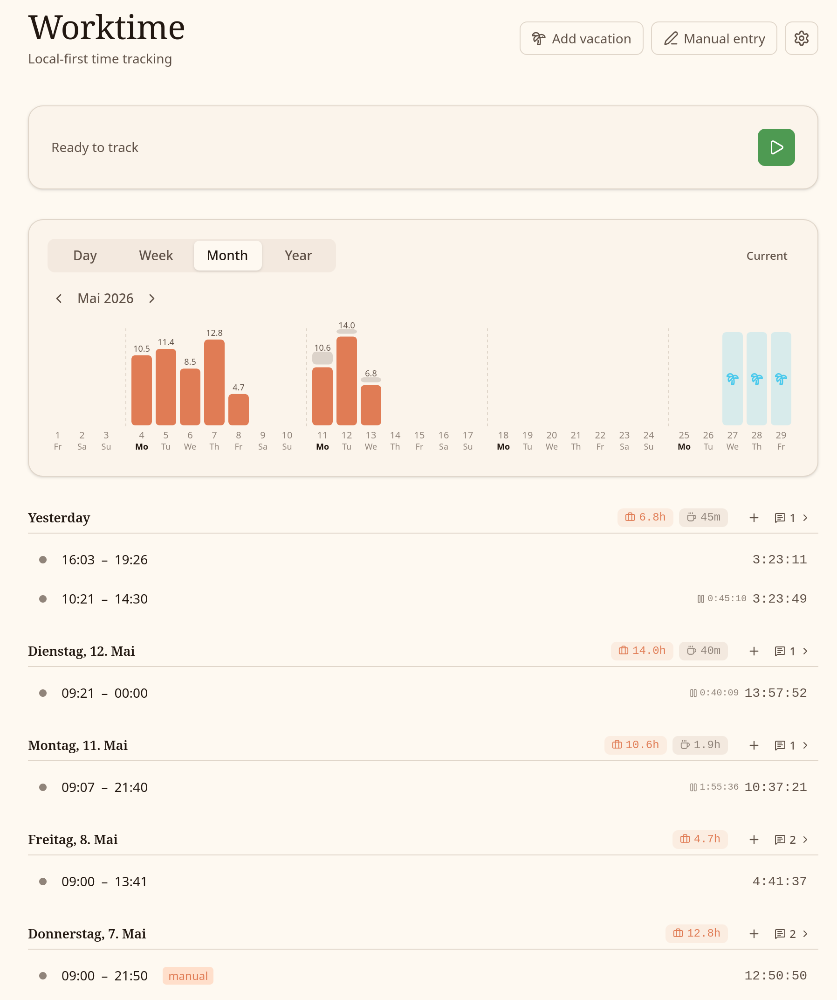

<p align="center">
  
</p>

<h1 align="center">Worktime Tracker</h1>

<p align="center">
  A warm, local-first desktop app for tracking your work hours.
</p>

<p align="center">
  
  
  
  
  
  
</p>

> **Heads up:** This project was entirely vibe-coded with AI. It works, but use it with care.

---

<p align="center">
  
</p>

## Features

- **Start / Stop / Pause** &mdash; one-click time tracking with pause support
- **Pomodoro timer** &mdash; configurable work/break cycles with desktop notifications
- **Year heatmap** &mdash; GitHub-style contribution grid showing your work patterns
- **Monthly bar chart** &mdash; daily hours at a glance for any month
- **Week summary** &mdash; hours per day with weekly totals
- **Day timeline** &mdash; visual breakdown of work and pause segments
- **Daily notes** &mdash; timestamped notes attached to any day
- **Vacation tracking** &mdash; mark days off, reflected across all views
- **Manual entries** &mdash; backfill forgotten sessions after the fact
- **Portable database** &mdash; SQLite file you can move, back up, or sync anywhere
- **System tray** &mdash; minimizes to tray, keeps tracking in the background

## Tech Stack

| Layer    | Technology                                                                            |
| -------- | ------------------------------------------------------------------------------------- |
| Shell    | [Tauri v2](https://v2.tauri.app) (Rust)                                               |
| Frontend | [SvelteKit](https://svelte.dev) + [Svelte 5](https://svelte.dev/docs/svelte/overview) |
| Styling  | [Tailwind CSS v4](https://tailwindcss.com)                                            |
| Database | SQLite via `@tauri-apps/plugin-sql`                                                   |
| Icons    | [Lucide](https://lucide.dev)                                                          |

## Getting Started

### Prerequisites

- [Rust](https://rustup.rs) toolchain
- [Node.js](https://nodejs.org) 18+
- [pnpm](https://pnpm.io)
- Linux: `libwebkit2gtk-4.1-dev`, `libayatana-appindicator3-dev`, `librsvg2-dev`

### Development

```bash
pnpm install
pnpm tauri dev
```

### Build

```bash
pnpm tauri build
```

Produces `.deb`, `.rpm`, and `.AppImage` packages in `src-tauri/target/release/bundle/`.

### Install (Linux)

```bash
sudo dpkg -i "src-tauri/target/release/bundle/deb/Worktime Tracker_0.1.0_amd64.deb"
```

## How It Works

All data lives in a single SQLite file at a location you choose on first launch. Times are stored as UTC with timezone metadata, so your data stays correct if you travel. The app groups everything by your local day.

Sessions left running past midnight are automatically clamped to the end of the start day.

## License

[MIT](LICENSE)
